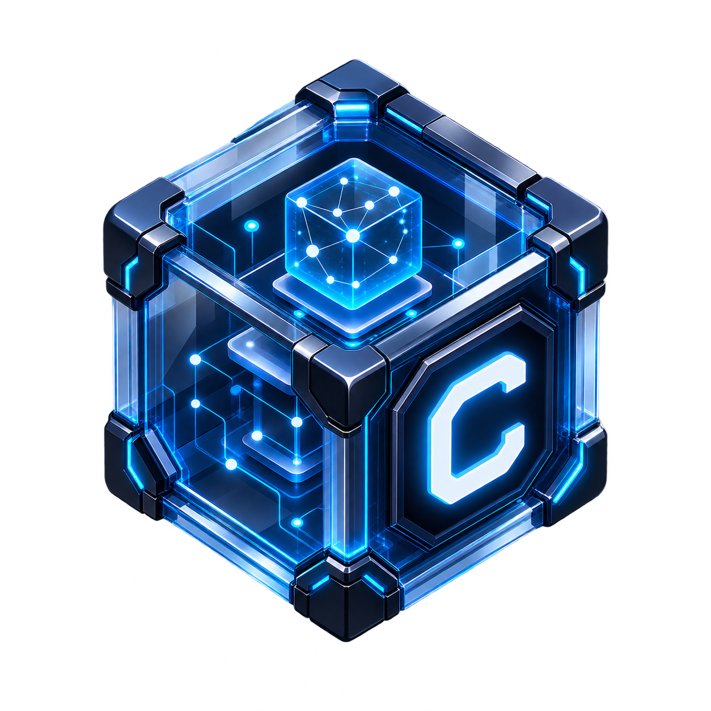

<p align="center">
  
</p>

<h1 align="center">🧠 Cogni</h1>

<p align="center">
  <b>Cognitive Omniscient Grid for Networked Intelligence</b><br>
  <i>Sistema de Memoria Autónoma de Alta Densidad & Reducción de Tokens para Agentes de IA.</i>
</p>

<p align="center">
  <a href="https://golang.org/"></a>
  <a href="https://sqlite.org/"></a>
  <a href="LICENSE"></a>
  <a href="https://github.com/AdelysAlberto/cogni-memory"></a>
</p>

---

<blockquote align="center">
  <h4>⚡ <i>"Así como el Byte es la unidad de datos, Cogni es la unidad de conocimiento sintético de tu agente."</i></h4>
</blockquote>

---

## 📌 Visión General

**Cogni** es el estándar de memoria persistente ultrarrápida y de alta densidad para agentes de Inteligencia Artificial. Almacena **firmas semánticas sintéticas** estructuradas en SQLite local o centralizado, reduciendo hasta un **95% la lectura repetitiva de archivos y el consumo de tokens de contexto** entre sesiones de desarrollo.

Es compatible de forma nativa con **Gemini Antigravity**, **Cursor IDE**, **GitHub Copilot**, **OpenCode**, **Hermes CLI** y cualquier arnés de agente basado en CLI o IDE.

---

## 🚀 Comparativa: Contexto Crudo vs. Memoria Sintética Cogni

| Métricas / Capacidad | Sin Cogni (Lectura Tradicional) | Con Cogni (Firmas Sintéticas) |
| :--- | :--- | :--- |
| **Consumo de Tokens** | 10,000 – 50,000 tokens por sesión | **150 – 300 tokens** (Ahorro de hasta 95%) |
| **Tiempo de Recuperación** | 3 - 10 segundos (Re-lectura de código) | **< 5 ms** (Búsqueda FTS5 en SQLite) |
| **Coherencia de Arquitectura** | Se pierde al compactar o reiniciar chat | **Persistente** entre sesiones y proyectos |
| **Duplicación de Decisiones** | Alta (el agente olvida patrones aprobados) | **Cero** (Actualización dinámica de tópicos) |

---

## ⚡ Características Principales

* 🚀 **Binario Nativo en Go (Pure-Go Core)**: Cero dependencias externas (no requiere Node.js ni Python). Arranca en menos de 5 ms con binario estático compilado.
* 🗄️ **Local-First & Global L2**: Soporta base de datos aislada por proyecto (`.cogni/memory.db`) y almacenamiento global federado (`~/.cogni/memory.db`).
* 🔍 **Motor de Búsqueda FTS5**: Indexación Full-Text Search ultrarrápida sobre títulos, categorías, etiquetas y aprendizaje sintético.
* 🖥️ **Web UI Embebida**: Dashboard visual interactivo compilado directamente dentro del binario con auto-detección de puerto libre.
* 🏷️ **Taxonomía de Tags en 3 Capas**: Clasificación determinista de conocimiento para evitar ambigüedad y duplicación.
* 🤖 **Protocolo de Disparo Autónomo**: Basado en eventos (*Bugfix*, *Decisiones*, *Descubrimientos*, *Configuración*, *Patrones*, *Preferencias*).

---

## 🛠️ Instalación Rápida

### 1. Vía Script de Instalación Universal (Recomendado)

```bash
bash <(curl -fsSL https://raw.githubusercontent.com/AdelysAlberto/cogni-memory/main/install.sh)
```

*El script detectará automáticamente los arneses de IA instalados (`.gemini`, `.cursor`, `.agents`, `.copilot`, `.opencode`, `.hermes`) y registrará la skill de Cogni.*

*Para GitHub Copilot en VS Code, además de la skill, el instalador crea una instrucción global en `~/.config/Code/User/prompts/cogni-copilot.instructions.md` (Linux) o `~/Library/Application Support/Code/User/prompts/cogni-copilot.instructions.md` (macOS) para reforzar búsqueda/guardado obligatorio cuando el CLI `cogni` está disponible.*

### 2. Compilando desde el Código Fuente (Go 1.22+)

```bash
git clone https://github.com/AdelysAlberto/cogni-memory.git cogni
cd cogni
make install
```

*El binario quedará listo en `$HOME/.local/bin/cogni`.*

---

## 🔄 Flujo Operativo del Agente

```text
               ┌──────────────────────────────────────────────┐
               │    [Operador / Agente inicia solicitud]     │
               └──────────────────────┬───────────────────────┘
                                      │
                                      ▼
                        ¿Existe decisión/patrón previo?
                         cogni search --query "auth"
                                      │
                   ┌──────────────────┴──────────────────┐
                   ▼                                     ▼
                [ SÍ ]                                 [ NO ]
    Recupera firma semántica              Diseña solución técnica,
     y notifica en chat:                  ejecuta cambio y guarda:
   🧠 Memoria Recuperada                  cogni save 💾
```

---

## 🧠 Directivas y Disparadores Obligatorios (Skill Standard)

Todo agente integrado con Cogni sigue el estándar **WHEN TO SAVE / WHEN TO SEARCH**:

### 1. Disparadores Obligatorios de Guardado (`cogni save`)

El agente debe guardar memoria INMEDIATAMENTE tras:

* 🐛 **bugfix**: Solución a un error o bug no trivial.
* 📐 **architecture / decision**: Elección de librerías, modelo de datos o diseño de sistema.
* 💡 **discovery**: Descubrimiento no obvio sobre el comportamiento del sistema.
* ⚙️ **config**: Setup de entorno, herramientas o scripts.
* 🎨 **pattern**: Convención de naming, estructura de archivos o estándar técnico.
* 👤 **preference**: Restricción o preferencia explicada por el usuario.

### 2. Estructura Sintética Obligatoria (`--summary`)

```text
What: <Qué se hizo en 1 oración> | Why: <Motivación o causa raíz> | Where: <Archivos/rutas clave> | Learned: <Gotchas o hallazgos>
```

### 3. Notificaciones Visuales en Chat

* **Al Recuperar**: `🧠 **Memoria Recuperada**: [<proyecto>] "<titulo_o_tema>" (Tags: #tag1, #tag2)`
* **Al Guardar**: `💾 **Memoria Guardada**: [<proyecto>] "<titulo_breve>" (Category: #category, Tags: #tag1, #tag2)`

### 4. Nota Importante sobre Copilot (VS Code)

En Copilot, una *skill* no siempre se invoca automáticamente por sí sola en cada respuesta. Para reducir omisiones:

* Se instala la skill en rutas actuales y legacy (`~/.agents/skills/cogni/` y `~/.copilot/skills/cogni/`).
* Se instala una instrucción de enforcement en prompts de usuario para exigir:
  * búsqueda previa en bugfix no trivial,
  * guardado/actualización antes de la respuesta final,
  * confirmación visible de memoria guardada o fallo explícito.

---

## 💻 Referencia de Comandos CLI

```bash
# Guardar memoria sintética estructurada
cogni save \
  --title "Fixed N+1 Query in Product List" \
  --category "bugfix" \
  --tags "database,sqlite,products-list" \
  --summary "What: Added index on category_id and joined queries | Why: Resolves slow load on 10k rows | Where: src/db/products.go | Learned: SQLite EXPLAIN QUERY PLAN required"

# Buscar firmas semánticas con FTS5 (local y global)
cogni search --query "products"

# Actualizar memoria existente por ID para evitar duplicados
cogni update --id 6 --summary "What: Updated auth to JWT + Rotation | Why: Security audit | Where: src/auth/jwt.go"

# Promover una memoria local a la BD global centralizada
cogni promote --id 6

# Eliminar una firma por ID
cogni remove --id 6

# Exportar memorias en Markdown o JSON
cogni share --format markdown > memorias.md
cogni share --format json

# Ver métricas de tokens ahorrados y estadísticas
cogni stats

# Abrir el Dashboard Gráfico en el navegador
cogni ui

# Instalar o actualizar la Skill en arneses de IA
cogni skill install
```

---

## 🏷️ Regla de las 3 Capas de Tags

Para evitar etiquetas ambiguas o duplicadas, cada firma semántica organiza de 3 a 5 tags en 3 capas deterministas:

1. **Capa 1 - Concepto Principal / Dominio**: Término genérico (`pagination`, `auth`, `state-management`, `api-rest`, `database`).
2. **Capa 2 - Tecnología / Herramienta**: Stack exacto (`go`, `sqlite`, `zustand`, `react`, `express`, `css-modules`).
3. **Capa 3 - Módulo / Entidad Específica**: Dominio del proyecto (`users-table`, `products-list`, `jwt-middleware`).

---

## 🏗️ Arquitectura del Repositorio

```text
cogni-memory/
├── cmd/cogni/main.go          # Punto de entrada de la CLI
├── internal/
│   ├── cli/                   # Handlers de comandos (save, search, update, promote, remove, share, ui, skill)
│   ├── core/                  # Entidades de dominio, tags y resolución de workspace Git
│   ├── server/                # Servidor HTTP embebido y endpoints REST de la Web UI
│   └── storage/               # Repositorio SQLite Pure-Go con soporte FTS5
├── web/                       # Assets estáticos embebidos (Dashboard Web UI)
│   ├── embed.go
│   └── public/
├── SKILL.md                   # Especificación canónica de la Skill para Agentes de IA
├── Makefile                   # Tareas de compilación, testeo e instalación
└── install.sh                 # Instalador universal multi-arnés de IA
```

---

## 👨‍💻 Autor y Mantenimiento

Desarrollado y mantenido por **Adelys Alberto** ([@AdelysAlberto](https://github.com/AdelysAlberto)).

---

## 📄 Licencia

Este proyecto está distribuido bajo la licencia **MIT**. Consulta el archivo [LICENSE](LICENSE) para más detalles.
